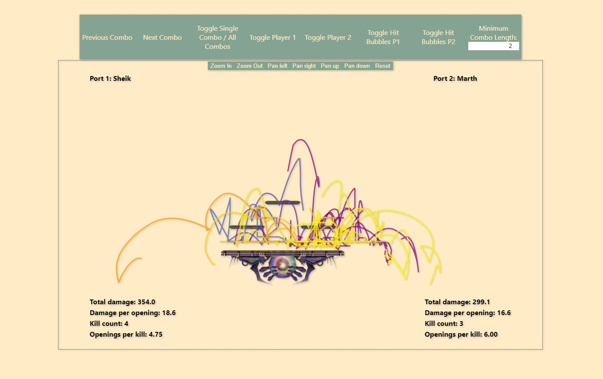

<h1>Slippi Combo Tracker</h1>
<h5>by Warren Goodson (aka Bud McChud)</h5>
<h4>Version 0.9.1</h4>

<h4>Built with:</h4>
<ul>
    <li>React.js</li>
    <li>D3.js</li>
    <li>slippi-parser-js</li>
</ul>

<h3>Features:</h3>
<ul>
    <li>Combo path visualization for both offense and defense.</li>
    <li>Ability to toggle players' paths and hit bubbles.</li>
    <li>Hit bubbles show character and hit when hovered over.</li>
    <li>Detailed combo stats.</li>
    <li>Full-game combo and damage stats.</li>
    <li>Filter combos by minimum length.</li>
    <li>Zooming and panning of stage space.</li>
    <li>Ability to see all combo paths from entire game at once, or just one combo at a time.</li>
</ul>

<h3>In the near future:</h3>
<ul>
    <li>User upload of game replay files.</li>
    <li>Switch between games.</li>
</ul>

<h3>In the... well, the future:</h3>
<ul>
    <li>User accounts.</li>
    <li>Save replay files to your account for easy access.</li>
    <li>New visualizations of movement (stock by stock).</li>
    <li>Other visualizations based on slippi data.</li>
</ul>